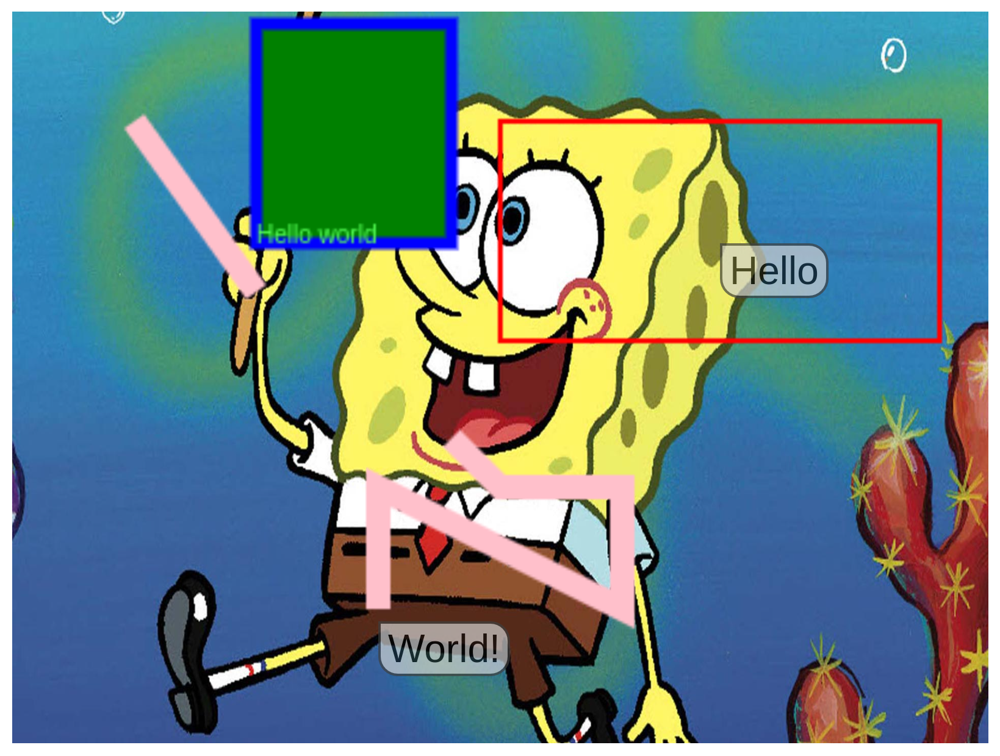

# image-artist

## Introduce
+ [Roadmap](#roadmap)
+ [Usage](#usage)
  + [Example](#example-code-and-screen-shot) 
+ [Contributing](#contributing)
+ [License](#license)

## Roadmap
You can see what we've done before and what we will work on in the future;

`// TODO`

## Usage

### 1 - Import script
Append script source to the body element

```html
<html>
  <body>

      <!-- some html code -->
    <script src="https://raw.githubusercontent.com/saracalihan/image-artist/main/dist/script.js"></script>
  </body>
</html>

```
### 2 - Add HTML element
Add `image-maker` element then set attributes.

> All attributes except `src` are optional

```html
<html>
  <body>
        <image-artist
          id="marker"
          data-src="https://d1z0xtmfw63f9i.cloudfront.net/cula4/wp-content/uploads/2021/07/Spongebob2.jpg"
          data-width="400"
          data-height="300"
          data-title="sponge bob"
          data-onClick="click"
        />
      <!-- some html code -->
    <script src="https://raw.githubusercontent.com/saracalihan/image-artist/main/dist/script.js"></script>
  </body>
</html>
```

### 3 - Use function interface

```html
<html>
  <body>
        <script>
          function click(e) {
              console.log({ clicked: e });
          }
        </script>
        <image-artist
          id="marker"
          data-src="https://d1z0xtmfw63f9i.cloudfront.net/cula4/wp-content/uploads/2021/07/Spongebob2.jpg"
          data-width="400"
          data-height="300"
          data-title="sponge bob"
          data-onClick="click"
        />
      <!-- some html code -->
    <script src="../dist/script.js"></script>
    <script>
      let marks = [
            {
                id: "fr",
                shape: "rect",
                coords: [100, 10, 80, 90],
                borderColor: "blue",
                fillColor: 'green',
                lineWidth: 5,
            },
            {
                id: "r",
                title: "Hello",
                shape: "rect",
                coords: [200, 50, 180, 90],
                events: {
                    onMouseLeave(){console.log('rect mouse leave trigered')}
                }
            },
            {
                id: "l",
                shape: "line",
                fillColor: 'pink',
                lineWidth: 10,
                coords: [50, 50, 100, 120],
            },
            {
                id: "p",
                title: "World!",
                shape: "polygone",
                coords: [150, 250, 150, 200, 250, 250, 250, 200, 200, 200, 180, 180],
            }
        ];
         marker.drawArray(marks);

         marker.drawText({ text: 'Hello world', x: 100, y: 100, color: '#5f5' });
    </script>
  </body>
</html>
```

Now its ready to work :)



[Try it](https://codepen.io/saracalihan/pen/vYxxMjg)


### Attributes

| Attribute | Description | Values | Default Value |
| --------- | ----------- | ------ | ------------- |
| data-src | Image source like `img` elements `src` attributes | `string` |  |
| data-width | Component width with pixel unit  | `number` |  |
| data-height | Component width with pixel unit  | `number` |  |
| data-title | Image's title, its show if src is invalid  | `string` | `image not found!`  |
| data-onClick | Name of main component's `click` event handler  | `string` |  |
| data-onMouseMove | Name of main component's `mousemove` event handler  | `string` |  |
| data-onMouseDown | Name of main component's `mousedown` event handler  | `string` |  |
| data-onMouseUp | Name of main component's `mouseup` event handler  | `string` |  |
| data-onMouseEnter | Name of main component's `mouseenter` event handler  | `string` |  |
| data-onMouseLeave | Name of main component's `mouseleave` event handler  | `string` |  |


### Types

### Function Interface

| name | Description | Paramaters(`name`, `type`, `description`) | Return value |
| ---- | ----------- | ---------- | ------------ |
| draw  | Draw a shape |    | `void`  |
| drawArray  | Draw a lot shape one time |    | `void`  |
| drawText  | Write text on canvas |    | `void`  |
| clear  | Remove shape | + `id`: 'string', Unique shape id | `void`  |
| clearAll  | Remove all shapes |  | `void`  |
| setLabel  | Add label to shape | <table> <tr> <td> id </td>  <td> string </td> <td> unique shape id </td> <tr> <td> text </td>  <td> string </td> <td> value of label </td> </tr>  <tr> <td> events </td>  <td> object:  </td> <td> label's HTML events </td> </tr>  </table> | `void`  |
| setHtmlLabel  | Add custom label to shape with HTML |  | `void`  |
| removeLabel  | Remove  label | + `id`: 'string', Unique shape id  | `void`  |


### Example code and screenshot
```html

```

---


## Contributing
`// TODO`
## License
[GNU GENERAL PUBLIC LICENSE Version 3](LICENSE)
